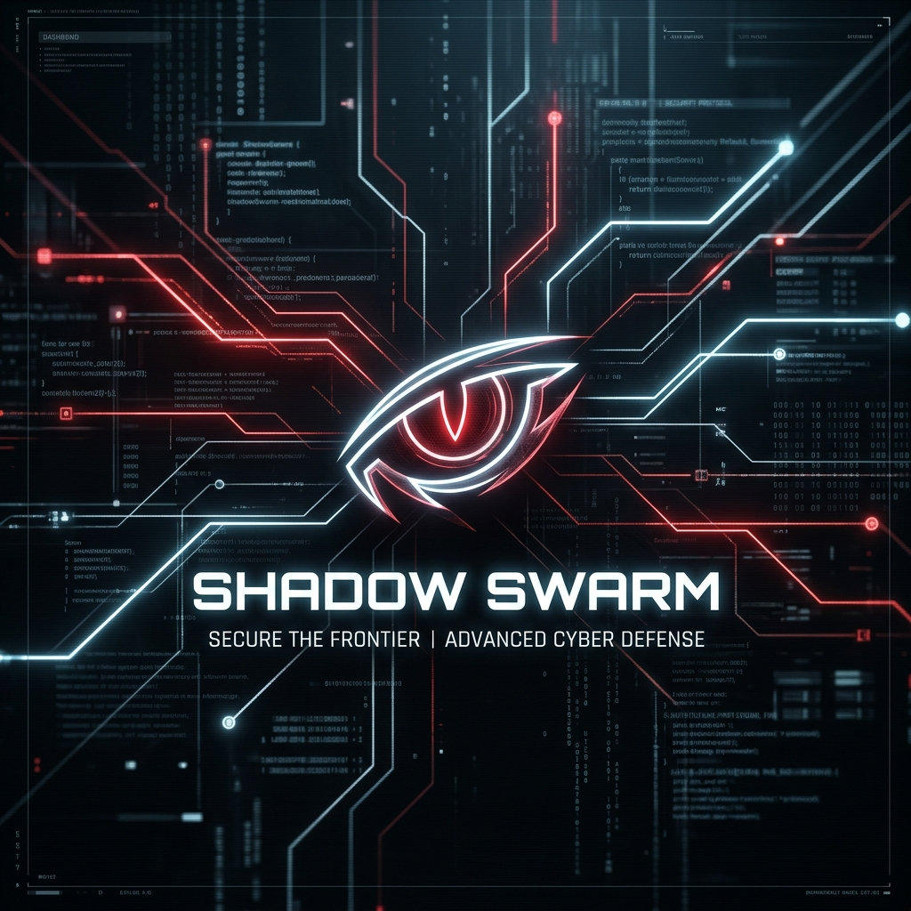

# 🛡️ Shadow Swarm v3: The Claude-Native Predator



> **The high-fidelity adversarial orchestrator of the DevAgent Ecosystem.**  
> *Shadow Swarm v3 leverages the official Claude Code CLI engine to perform deep-architecture security audits, proven exploits, and Anthropic-grade security guidance.*

Shadow Swarm v3 is a "Best Quality" standalone masterpiece. It doesn't just scan code; it orchestrates a high-power Claude CLI session to "Think like a Hacker," execute Proof-of-Concept scripts, and verify vulnerabilities in real-time.

---

## 🌟 Key Features

### 🤖 Claude-Native Orchestration
Shadow v3 uses the official **Claude Code CLI** (`claude`) as its reasoning engine, unlocking:
-   **🔥 High-Effort Reasoning**: Deep scans using the `--effort high` architectural analysis flag.
-   **🏹 Autonomous Exploits**: Claude's ability to run shell commands to verify and prove logic leaks.
-   **🛡️ Official Security Hooks**: Integration with the `security-guidance` logic (inspired by ddworken) to catch prohibited patterns.

### 📺 Real-Time Predator Dashboard
A dynamic, live-updating terminal interface built with **Rich** that streams telemetry directly from the Claude CLI Engine, showing findings and tool-use in real-time.

---

## 🛠️ Quick Start

### 1. Prerequisites
Ensure **Claude Code** and **Node.js** are installed:
```bash
npm install -g @anthropic-ai/claude-code
pip install rich click anthropic python-dotenv
```

### 2. Launch the Predator
Audit your project using the high-fidelity Claude-Native engine:
```bash
python3 shadow.py --target ./my_project
```

---

## 🛡️ License
MIT License
